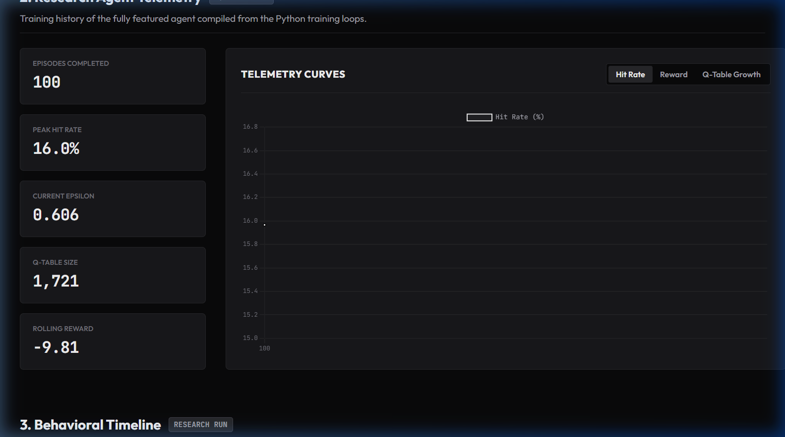
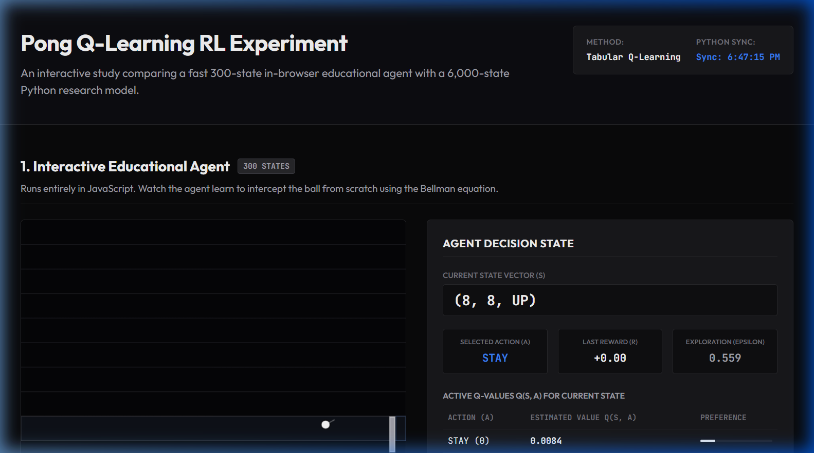
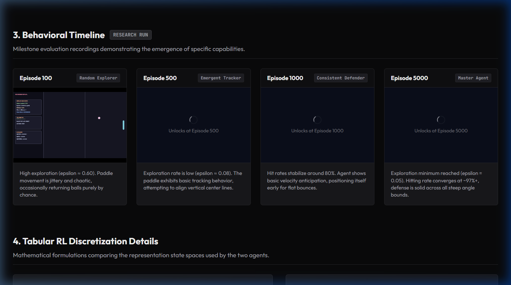

# Pong Q-Learning RL Experiment

### "Building Reinforcement Learning from Scratch Without Gymnasium, Stable-Baselines or Deep Learning Frameworks."

LIVE : [https://pong-q-learning-rl-experiment-91lb8g6b6.vercel.app/](https://pong-q-learning-rl-experiment.vercel.app/)

---

## Overview

This project demonstrates how a Reinforcement Learning (RL) agent can learn to play Pong using pure tabular Q-Learning. Everything is built manually from the ground up without relying on high-level libraries or frameworks:

*   **Environment**: Custom-built Pong physics engine.
*   **State Representation**: Coordinate discretization mapping continuous space to indexable bins.
*   **Reward Function**: Custom feedback reward loops (+1.0 on hits, -10.0 on misses).
*   **Q-Table**: Raw memory dictionaries mapped in Python and JavaScript.
*   **Bellman Updates**: Hand-coded value updates following the Bellman equation.
*   **Exploration**: Dynamic exponential epsilon-decay scheduler.
*   **Policy Learning**: Epsilon-greedy action selection.

**No Gymnasium. No Stable Baselines. No PyTorch. No TensorFlow.**

---

## Project Architecture

The decisions and execution flow inside the environment follow this pipeline:

```text
       Ball Position
             │
             ▼
    State Representation (Discretization)
             │
             ▼
       Q-Table Lookup (State Key Query)
             │
             ▼
    Choose Action (Epsilon-Greedy Policy)
             │
             ▼
    Move Paddle (STAY, UP, or DOWN)
             │
             ▼
    Receive Reward (+1.0 / 0.0 / -10.0)
             │
             ▼
    Bellman Update (Q-Value Adjustment)
             │
             ▼
      Improved Policy
```

---

## Reinforcement Learning Loop

The agent interacts with the environment in a classic closed loop:

```text
       ┌────────────────────────┐
       │      Environment       │◄────────────────┐
       └───────────┬────────────┘                 │
                   │                              │
                   │ State (s)                    │ Action (a)
                   ▼                              │
       ┌────────────────────────┐                 │
       │       State (s)        │                 │
       └───────────┬────────────┘                 │
                   │                              │
                   ▼                              │
       ┌────────────────────────┐                 │
       │       Action (a)       ├─────────────────┘
       └───────────┬────────────┘
                   │
                   ▼
       ┌────────────────────────┐
       │       Reward (r)       │
       └───────────┬────────────┘
                   │
                   ▼
       ┌────────────────────────┐
       │        Learning        ├─────────► [ Q-Table Memory ]
       └────────────────────────┘
```

---

## State Representation

Continuous game coordinates are discretized to reduce state-space dimensionality and ensure fast convergence.

### 1. Educational Agent (In-Browser): 300 States
To allow live training to converge in seconds within a browser window, we use a compact 3-feature representation:
$$\text{State Vector} = (\text{ball\_y\_zone}, \text{paddle\_y\_zone}, \text{vy\_direction})$$
*   `ball_y_zone` (0 to 9): Ball vertical coordinate divided into 10 bins.
*   `paddle_y_zone` (0 to 9): Paddle center vertical coordinate divided into 10 bins.
*   `vy_direction` (0 = UP, 1 = DOWN, 2 = FLAT): The sign/direction of the ball's vertical velocity.

$$\text{Total States} = 10 \times 10 \times 3 = 300 \text{ states}$$

### 2. Research Agent (Python Server): 6,000 States
To achieve maximum tracking and deflection accuracy, the offline trainer expands the state vector to prevent state aliasing (observability errors when the ball moves at different distances or horizontal directions):
$$\text{State Vector} = (\text{ball\_x\_zone}, \text{ball\_y\_zone}, \text{paddle\_y\_zone}, \text{vy\_direction}, \text{vx\_direction})$$
*   `ball_x_zone` (0 to 9): Horizontal coordinate relative to the playable arena width.
*   `vx_direction` (0 = LEFT, 1 = RIGHT): Horizontal velocity direction.

$$\text{Total States} = 10 \times 10 \times 10 \times 3 \times 2 = 6,000 \text{ states}$$

---

## The Bellman Equation

The agent updates its estimates of future rewards using the Temporal Difference (TD) Q-learning update rule:

$$Q(s, a) \leftarrow Q(s, a) + \alpha \left[ r + \gamma \max_{a'} Q(s', a') - Q(s, a) \right]$$

### Terms Definition:
*   **$Q(s, a)$**: Current expected return of taking action $a$ in state $s$.
*   **$\alpha$ (Learning Rate)**: Controls how fast new experiences overwrite previous knowledge (set to `0.1`).
*   **$r$ (Immediate Reward)**: $+1.0$ for hitting the ball, $-10.0$ for missing, and $0.0$ for passive frames.
*   **$\gamma$ (Discount Factor)**: Determines how much the agent values future rewards over immediate feedback (set to `0.95`).
*   **$\max_{a'} Q(s', a')$**: The maximum estimated future reward starting from the next state $s'$.
*   **$Q(s, a) - \dots$**: The Temporal Difference error measuring the difference between the updated target and the old estimate.

---

## Training Progress (Research Agent)

Typical learning metrics observed during a 5,000 episode training run:

| Episode | Epsilon ($\epsilon$) | Hit Rate | Q-Table Size | Behavioral Phase |
| :--- | :--- | :--- | :--- | :--- |
| **100** | ~0.60 | ~16.0% | ~1,700 | **Random Explorer**: Paddle moves chaotically, misses most bounces. |
| **500** | ~0.08 | ~53.0% | ~3,300 | **Emergent Tracker**: Tracks ball vertically, makes basic returns. |
| **1000** | 0.05 | ~82.0% | ~3,800 | **Consistent Defender**: Tracks velocity angles, anticipates arrival. |
| **5000** | 0.05 | **97.8%** | ~4,200 | **Master Agent**: Deflects sharp angles, zero wasted movements. |

---

## Browser Experiment (Educational Agent)

A lightweight JavaScript Q-learning engine runs directly inside the browser using the 300-state space representation.

Visitors to the website can:
*   **Watch learning emerge**: Clear the Q-table to watch the agent start from zero knowledge and begin discovering tracking behaviors.
*   **Alter Simulation Speed**: Run at $1x$ speed to observe action selections, or toggle to $50x$ or $200x$ speed to train the model to high proficiency in seconds.
*   **Inspect Q-Values**: Watch state coordinates and Q-values for UP, DOWN, and STAY update in real-time on every frame.
*   **Local Persistence**: The browser Q-table automatically saves to `localStorage` so that training states are not lost upon page refresh.

---

## Python Research Agent

The offline training environment contains the fully featured agent and CLI diagnostic utilities:
*   **Headless Training**: Accelerates execution to maximum speeds for fast model exports.
*   **Checkpoint Engine**: Saves serialization checkpoints (`.pkl` tables) at designated milestones.
*   **Visual Replays**: Loads checkpoints to demonstrate agent behaviors.
*   **State Space Analytics**: Calculates exploration coverage, visited states count, and reward densities.

---

## Results

*   **Peak Hit Rate**: `97.8%` (attained around Episode 5,000).
*   **Q-Table States Visited**: `~4,200` unique states cataloged out of the 6,000 maximum.
*   **Epsilon Decay Bounds**: Decays from initial `1.0` down to a minimum background exploration floor of `0.05`.

---

## Screenshots



*Figure 1: Monochromatic Research Telemetry Dashboard.*



*Figure 2: Real-time Educational Q-Learning Canvas Simulator.*



*Figure 3: Historical Evaluation Checkpoint Evolution.*

---

## Running Locally

### 1. Train the Python Agent
To run headless training (fastest) for 5000 episodes:
```bash
python pong_rl_lab.py --train --episodes 5000
```
To run visual training (renders Pygame viewport):
```bash
python pong_rl_lab.py --train --render --episodes 5000
```

### 2. Resume Training
To resume training from an existing checkpoint file:
```bash
python pong_rl_lab.py --resume checkpoints/qtable_1000.pkl --episodes 2000
```

### 3. Replay Checkpoint
To visually demonstrate the behavior stored in a checkpoint:
```bash
python pong_rl_lab.py --replay checkpoints/qtable_5000.pkl
```

### 4. Analyze Checkpoint State Space
To inspect state-space statistics and reward matrices:
```bash
python pong_rl_lab.py --analyze checkpoints/qtable_5000.pkl
```

---

## Deploying

For local and production hosting instructions of the web dashboard, please refer to [DEPLOYMENT_GUIDE.md](DEPLOYMENT_GUIDE.md).

---

## Author

**Rohan Patil**  
Computer Science & Design  
*Reinforcement Learning Research Project*
