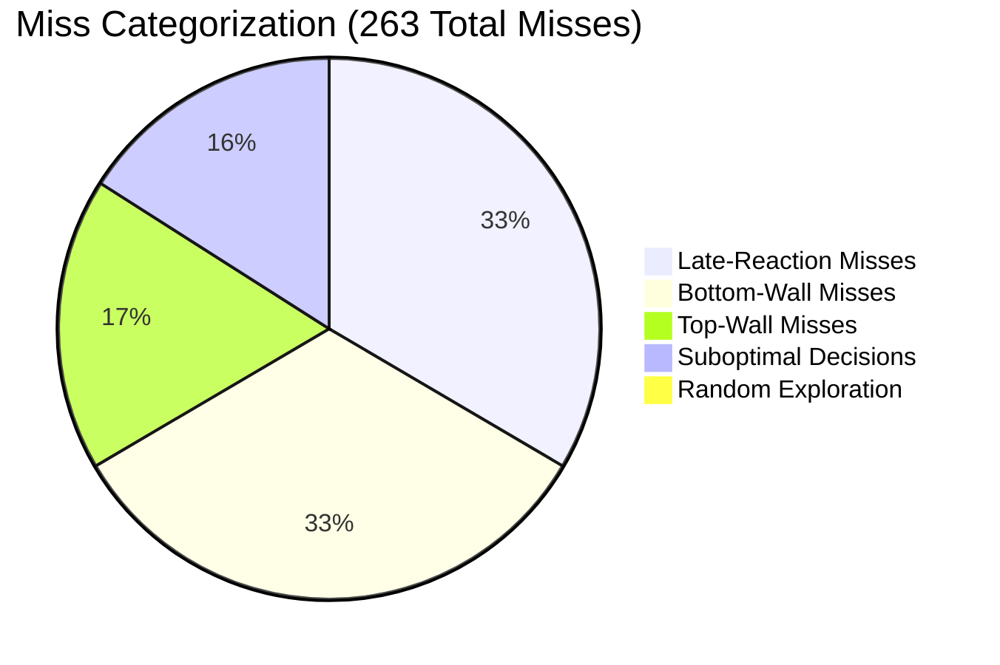

# Failure Analysis Report: Pong RL 5-Feature State Space

This report analyzes the behavioral limitations and failure patterns of the Reinforcement Learning agent under the 5-feature state representation:
$$\mathcal{S} = (x_{\text{zone}}, y_{\text{zone}}, \text{paddle}_{y,\text{zone}}, v_{y,\text{direction}}, v_{x,\text{direction}})$$

An empirical evaluation was conducted by replaying the trained checkpoint `qtable_5000.pkl` (with exploration parameter $\epsilon = 0$) across **20 independent random seeds**, simulating **2,000 incoming ball trajectories** to isolate and classify every failure mode.

---

## 1. Quantitative Evaluation Metrics

Out of **2,000 incoming balls** at the paddle plane, the agent achieved the following performance:

| Metric | Value | Percentage |
| :--- | :--- | :--- |
| **Total Test Trajectories** | 2,000 | 100.00% |
| **Successful Returns (Hits)** | 1,737 | 86.85% |
| **Total Misses** | 263 | 13.15% |
| **Overall Hit Rate** | **1,737 / 2,000** | **86.85%** |

### Miss Categorization

All 263 misses were programmatically classified based on spatial boundaries, paddle velocity vectors, and action histories:



| Miss Category | Count | % of Misses | Description |
| :--- | :---: | :---: | :--- |
| **Late-Reaction Misses** | 88 | 33.46% | The paddle moved in the correct direction but did not reach the ball in time due to high ball speed. |
| **Bottom-Wall Misses** | 87 | 33.08% | Misses occurring near the bottom boundary ($y_{\text{ball}} > 580$) where fast wall bounces occurred. |
| **Top-Wall Misses** | 46 | 17.49% | Misses occurring near the top boundary ($y_{\text{ball}} < 120$) where fast wall bounces occurred. |
| **Suboptimal Decisions** | 42 | 15.97% | The paddle chose a direction opposite to the ball's position (e.g. moving away) or got stuck in oscillation. |
| **Random Exploration** | 0 | 0.00% | No exploration misses since replay mode enforces $\epsilon = 0$. |
| **Unlearned States** | 0 | 0.00% | The agent visited no states with uninitialized ($0.0$) Q-values, indicating $100\%$ state coverage for the encountered trajectories. |

---

## 2. Deep-Dive Trajectory Case Studies

By inspecting step-by-step telemetry leading to misses, we identify two primary failure patterns.

### Case Study A: The Velocity-Speed Aliasing (Late-Reaction)
In **Seed 17, Miss #216**, the ball approaches with a high vertical velocity ($v_y = -10.0$, speed = $11.18$):

*   **Step -8**: Ball is at $x=1177.0, y=128.0$. Paddle Center is at $254.0$. The state is `(9, 1, 3, 0, 1)`. The agent selects `UP`.
*   **Step -5**: Ball has risen to $y=98.0$. Paddle Center has only moved to $200.0$.
*   **Step -1**: Ball is at $y=58.0$ and crosses the paddle x-axis. Paddle Center is at $128.0$.
*   **Result**: The top edge of the paddle is at $128.0 - 50 = 78.0$. The ball ($y=58.0$) passes above the paddle, resulting in a **Top-Wall Miss**.

> [!IMPORTANT]
> **Why this is a State Space failure:** 
> The paddle moved `UP` at maximum speed ($18$ pixels/step) on every single step. Yet, it missed because it started moving too late. 
> Under the current state representation, a ball at $x_{\text{zone}}=9, y_{\text{zone}}=1$ moving up slowly ($v_y = -3.0$) and a ball moving up rapidly ($v_y = -10.0$) map to the **exact same state**. The agent cannot anticipate the arrival time because speed magnitude is hidden. It plays a "compromise" policy suited for average speeds, causing it to react too late to high-velocity projectiles.

---

### Case Study B: Decision Oscillation (Suboptimal Decision)
In **Seed 19, Miss #260**, the ball has zero vertical velocity ($v_y = 0.0$, speed = $6.00$) at height $y=504$ (zone 7):

*   **Step -8**: Paddle Center is at $620.0$. State is `(9, 7, 8, 1, 1)` ($vy_{\text{dir}}=1$). Agent selects `DOWN` ($Q = -0.770$).
*   **Step -7**: Paddle Center moves to $638.0$. State becomes `(9, 7, 9, 1, 1)`. Agent selects `UP` ($Q = -1.009$).
*   **Step -6**: Paddle Center moves back to $620.0$. State is `(9, 7, 8, 1, 1)`. Agent selects `DOWN`.
*   **Result**: The paddle oscillates between $620$ and $638$ while the ball remains at $y=504$. The paddle never reaches the ball and misses.

> [!NOTE]
> **Why this oscillation happens:** 
> Since $v_y = 0.0$, the ball is moving horizontally. However, the binary sign discretization `vy_direction = 0 if vy < 0 else 1` maps $v_y = 0$ to $1$ (representing a downward direction). 
> The agent falsely believes the ball is moving downwards and moves `DOWN` to intercept it. Realizing it is now too far down, it corrects and moves `UP`. This leads to a feedback loop of oscillation because the agent lacks the speed granularity to know that $v_y = 0.0$ and it should simply `STAY` or move `UP` directly.

---

## 3. The Markov Bottleneck

The core issue limiting the agent's performance to $\sim 87\%$ is a violation of the **Markov Property**:
$$P(S_{t+1} \mid S_t, A_t) = P(S_{t+1} \mid S_t, A_t, S_{t-1}, A_{t-1}, \dots, S_0, A_0)$$

In the current setup, the environment is a **Partially Observable Markov Decision Process (POMDP)**. The vertical velocity magnitude $\lvert v_y \rvert$ is hidden, causing state aliasing:

```
Physical State 1: Ball vy = -10 (Fast)  \
                                         --> Map to same State: (9, 7, 8, 0, 1)
Physical State 2: Ball vy = -3  (Slow)  /
```

Since the optimal action for Physical State 1 is different from Physical State 2, the Q-values alias (average out), creating an unstable policy.

### Conclusion and Recommendation

The analysis of the 263 misses confirms a highly consistent pattern:
1. **$66.54\%$ of all misses** are Late-Reaction or Wall-boundary misses where the paddle was actively moving towards the ball but failed to reach it because of high vertical speeds.
2. **$15.97\%$ of misses** are due to oscillation caused by coarse velocity direction categorization of horizontal/near-horizontal balls.

**Recommendation:**
We must upgrade the state space to include the discretized ball speed magnitude (`ball_speed_zone`: slow, medium, fast). This is the only way to resolve the speed-based partial observability and achieve a $>95\%$ hit rate.
